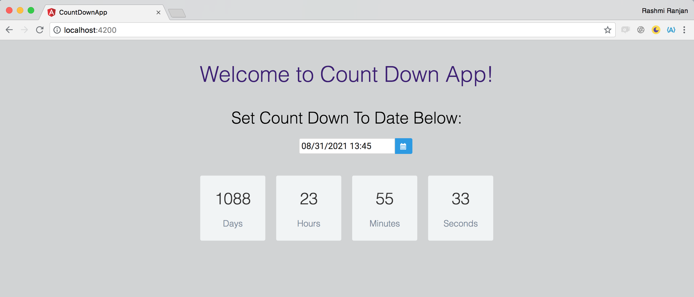

# Count Down Application

I used angularJS to implement this application. The whole project was generated with [Angular CLI](https://github.com/angular/angular-cli) version 6.0.8. This provided me with the base framework to build the application.

For simplicity I used the default app component to implement my application. However for much more complex applications it is recommended to build individual components based on functional requirement.

## Task
Build an user interface that counts down to a target date. In order to select a date I used [primeng's](https://www.primefaces.org/primeng/#/setup) datepicker component. 

Install primeng in the application using the following command:

```
npm install primeng --save
npm install primeicons --save
```

The Files I worked on are:
* ./count-down-app/src/app/app.component.css Composed of all the styling for the user interface elements in the application
* ./count-down-app/src/app/app.component.html: Contains the layout of the user interface
* ./count-down-app/src/app/app.component.ts: Contains the logic of count down application
* ./count-down-app/src/app/app.module.ts: Contains the dependencies and modules used for the application

## The Approach:

1. Have the user select a date from the date picker to which we will count down to.
2. Upon date selection. The date is injected from the HTML page to the app component file. The datepicker has a onchange angular event which then triggers the onSelectCountDownToDate().
3. This function then triggers a function at an interval of 1000 miliseconds.
4. The function triggered in step 3 finds the difference between current time and date to which counting is being done.
5. If the difference is greater than 0 then calculation for days, hours, minutes and seconds are done and the user interface elements are updated every 1 second
6. If the difference is less than 0 then day, hour, minutes and seconds are reset to 0


*Note:* All the time calculations are done in unix time format i.e. Number of miliseconds passed since 1st January 1970

## Ho to Run the application?

You would need to have a setup of angular js on your machine to run the application.

Download the project from github using
```
git clone https://github.com/rbidanta/count-down-app.git
```

Browse to the count-down-app directory and 
Run `ng serve` for a dev server. 

Navigate to `http://localhost:4200/`




